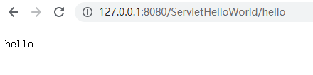
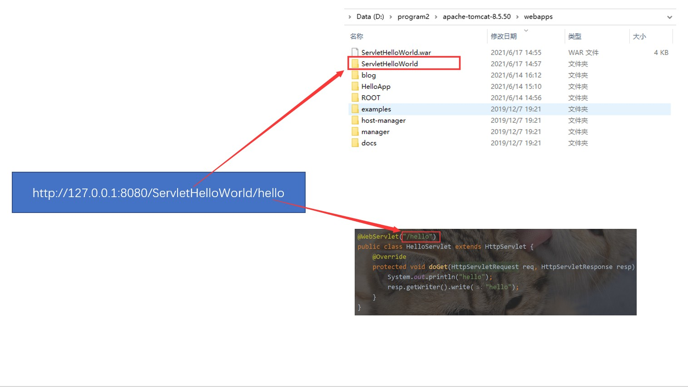
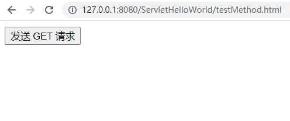

**Servlet**

# Servlet 是什么

Servlet 是一种实现动态页面的技术. 是一组 Tomcat 提供给程序猿的 API, 帮助程序猿简单高效的开发一 个 web app.

#### 回顾 动态页面 vs 静态页面

静态页面也就是内容始终固定的页面. 即使 **用户不同/时间不同/输入的参数不同** , 页面内容也不会发生 变化. (除非网站的开发人员修改源代码, 否则页面内容始终不变).

对应的, 动态页面指的就是 **用户不同/时间不同/输入的参数不同**, 页面内容会发生变化. 举个栗子:

Tomcat 的主页 https://tomcat.apache.org/ 就是一个静态页面.

而 B 站的主页 [https://www.bilibili.com/](http://www.bilibili.com/) 则是一个动态页面.

构建动态页面的技术有很多, 每种语言都有一些相关的库/框架来做这件事.

Servlet 就是 Tomcat 这个 HTTP 服务器提供给 Java 的一组 API, 来完成构建动态页面这个任务.

#### Servlet 主要做的工作

允许程序猿注册一个类, 在 Tomcat 收到某个特定的 HTTP 请求的时候, 执行这个类中的一些代码. 帮助程序猿解析 HTTP 请求, 把 HTTP 请求从一个字符串解析成一个 HttpRequest 对象. 帮助程序猿构造 HTTP 响应. 程序猿只要给指定的 HttpResponse 对象填写一些属性字段, Servlet 就会自动的安装 HTTP 协议的方式构造出一个 HTTP 响应字符串, 并通过 Socket 写回给客户端.

当然, Servlet 还支持一些其他的辅助功能, 此处暂时先不介绍.

简而言之, Servlet 是一组 Tomcat 提供的 API, 让程序猿自己写的代码能很好的和 Tomcat 配合起来, 从

而更简单的实现一个 web app.

而不必关注 Socket, HTTP协议格式, 多线程并发等技术细节, 降低了 web app 的开发门槛, 提高了开发效 率.

# 第一个 Servlet 程序

## 1. 创建项目

使用 IDEA 创建一个 Maven 项目.

1) 菜单 -\> 文件 -\> 新建项目 -\> Maven

2) 选择项目要存放的目录

3) 项目创建完毕后, 一般右下角会弹出以下对话框. 选择 Enable Auto-Import

## 2. 引入依赖

Maven 项目创建完毕后, 会自动生成一个 pom.xml 文件. 我们需要在 pom.xml 中引入 Servlet API 依赖的 jar 包.

1) 在中央仓库  <https://mvnrepository.com/> 中搜索 "servlet", 一般第一个结果就是.

2) 选择版本. 一般我们使用 3.1.0 版本

Servlet 的版本要和 Tomcat 匹配.

如果我们使用 Tomcat 8.5, 那么就需要使用 Servlet 3.1.0

可以在  <http://tomcat.apache.org/whichversion.html> 查询版本对应关系.

3) 把中央仓库中提供的 xml 复制到项目的 pom.xml 中

修改后的 pom.xml 形如

标签内部放置项目依赖的 jar 包. maven 会自动下载依赖到本地.

#### 关于 groupId, artifactId, version

这几个东西暂时我们不关注. 啥时候需要关注呢? 如果我们要把这个写的代码发布到中央仓库上, 那么就需要设定好这几个 ID 了.

groupId: 表示组织名称 artifactId: 表示项目名称 version: 表示版本号

中央仓库就是按照这三个字段来确定唯一一个包的.

红色方框圈出来的部分, 就是这个 jar 包的 groupId, artifactId, version

## 3. 创建目录

当项目创建好了之后, IDEA 会帮我们自动创建出一些目录. 形如

这些目录中:

src 表示源代码所在的目录

main/java 表示源代码的根目录. 后续创建 .java 文件就放到这个目录中. main/resources 表示项目的一些资源文件所在的目录. 此处暂时不关注. test/java 表示测试代码的根目录. 此处暂时不关注.

这些目录还不够, 我们还需要创建一些新的目录/文件.

#### 创建 webapp 目录

在 main 目录下, 和 java 目录并列, 创建一个 webapp 目录 (注意, 不是 webapps).

#### 创建 web.xml

然后在 webapp 目录内部创建一个 WEB-INF 目录, 并创建一个 web.xml 文件

注意单词拼写.

#### 编写 web.xml

往 web.xml 中拷贝以下代码. 具体细节内容我们暂时不关注.

webapp 目录就是未来部署到 Tomcat 中的一个重要的目录. 当前我们可以往 webapp 中放一些 静态资源, 比如 html , css 等.

在这个目录中还有一个重要的文件 web.xml. Tomcat 找到这个文件才能正确处理 webapp 中的 动态资源.

## 4. 编写代码

在 java 目录中创建一个类 HelloServlet, 代码如下:

创建一个类 , 继承自

在这个类上方加上 @WebServlet("/hello") 注解, 表示 Tomcat 收到的请求中, **路径为** /hello

**的请求才会调用 HelloServlet 这个类的代码.** (这个路径未包含 Context Path)

重写 doGet 方法. doGet 的参数有两个, 分别表示收到的 HTTP 请求 和要构造的 HTTP 响应. **这个 方法会在 Tomcat 收到 GET 请求时触发**

HttpServletRequest 表示 HTTP 请求. Tomcat 按照 HTTP 请求的格式把 字符串 格式的请求转

成了一个 HttpServletRequest 对象. 后续想获取请求中的信息(方法, url, header, body 等) 都是 通过这个对象来获取.

HttpServletResponse 表示 HTTP 响应. 代码中把响应对象构造好(构造响应的状态码, header,

body 等)

resp.getWriter() 会获取到一个流对象, 通过这个流对象就可以写入一些数据, 写入的数据会被 构造成一个 HTTP 响应的 body 部分, Tomcat 会把整个响应转成字符串, 通过 socket 写回给浏览 器.

这个代码虽然只有寥寥几行, 但是包含的信息量是巨大的.

1) 我们的代码不是通过 main 方法作为入口了. main 方法已经被包含在 Tomcat 里, 我们写的代码会被

Tomcat 在合适的时机调用起来.

此时我们写的代码并不是一个完整的程序, 而是 Tomcat 这个程序的一小部分逻辑.

2) 我们随便写个类都能被 Tomcat 调用嘛? 满足啥样条件才能被调用呢? 主要满足三个条件:

1.  创建的类需要继承自 HttpServlet

    b) 这个类需要使用 @WebServlet 注解关联上一个 HTTP 的路径

    c) 这个类需要实现 doXXX 方法.

当这三个条件都满足之后, Tomcat 就可以找到这个类, 并且在合适的时机进行调用.

## 5. 打包程序

使用 maven 进行打包. 打开 maven 窗口 (一般在 IDEA 右侧就可以看到 Maven 窗口, 如果看不到的话, 可以通过 菜单 -\> View -\> Tool Window -\> Maven 打开)

然后展开 Lifecycle , 双击 package 即可进行打包.

如果比较顺利的话, 能够看到 SUCCESS 这样的字样.

如果代码/配置/环境存在问题, 可能会提示 BUILD FAILED, 可以根据具体提示的错误信息具体解决.

打包成功后, 可以看到在 target 目录下, 生成了一个 jar 包.

这样的 jar 包并不是我们需要的, Tomcat 需要识别的是另外一种 war 包格式. 另外这个 jar 包的名字太复杂了, 我们也希望这个名字能更简单一点.

#### war 包和 jar 包的区别

jar 包是普通的 java 程序打包的结果. 里面会包含一些 .class 文件.

war 包是 java web 的程序, 里面除了会包含 .class 文件之外, 还会包含 HTML, CSS, JavaScript, 图 片, 以及其他的 jar 包. 打成 war 包格式才能被 Tomcat 识别.

ServletHelloWorld**-** .0**-** NAPSHOT.jar **的由来**

1 S

这个名字来源于

相当于把 artifactId 和 version 拼接起来了.

在 pom.xml 中新增一个 packing 标签, 表示打包的方式是打一个 war 包.

在 pom.xml 中再新增一个 build 标签, 内置一个 finalName 标签, 表示打出的 war 包的名字是

HelloServlet

完整的 pom.xml 形如

重新使用 maven 打包, 可以看到生成的新的 war 包的结果.

## 6. 部署程序

把 war 包拷贝到 Tomcat 的 webapps 目录下.

启动 Tomcat , Tomcat 就会自动把 war 包解压缩.

看到这个日志说明 Tomcat 已经正确识别了 ServletHelloWorld 这个 webapp.

## 7. 验证程序

此时通过浏览器访问 http://127.0.0.1:8080/ServletHelloWorld/hello

就可以看到结果了.

**注意:** URL 中的 PATH 分成两个部分, 其中 HelloServlet 为 Context Path, hello 为 Servlet Path

# 更方便的部署方式

手动拷贝 war 包到 Tomcat 的过程比较麻烦. 我们还有更方便的办法.

此处我们使用 IDEA 中的 Smart Tomcat 插件完成这个工作. 理解 "插件" (plugin)

\+ =

天火 + 擎天柱 =\> 会飞的擎天柱.

天火在牺牲之前把自己变成了擎天柱的 "飞行插件". 在擎天柱需要起飞的时候就变成翅膀装在擎天 柱身上. 不需要起飞的时候就卸下来放到擎天柱的集装箱里.

程序开发的时候也经常如此.

像 IDEA 这样的程序虽然功能强大, 但是也无法面面俱到. 对于一些特殊场景的功能, 开发者就可以 开发一些 "插件". 如果需要这个插件, 就单独安装.

#### 插件就是对程序的一些特定场景, 做出一些特定的功能的扩展.

**安装 Smart Tomcat 插件**

1.  菜单 -\> 文件 -\> Settings

1.  选择 Plugins, 选择 Marketplace, 搜索 "tomcat", 点击 "Install".

**注意**: 安装过程必须要联网.

3) 安装完毕之后, 会提示 "重启 IDEA"

**配置 Smart Tomcat 插件**

1.  点击右上角的 "Add Configuration"

1.  选择左侧的 "Smart Tomcat"

3) 在 Name 这一栏填写一个名字(可以随便写)

在 Tomcat Server 这一栏选择 Tomcat 所在的目录. 其他的选项不必做出修改.

其中 Context Path 默认填写的值是项目名称. 这会影响到后面咱们的访问页面.

4) 点击 OK 之后, 右上角变成了

点击绿色的三角号, IDEA 就会自动进行编译, 部署, 启动 Tomcat 的过程.

此时 Tomcat 日志就会输出在 IDEA 的控制台中, 可以看到现在就**不再乱码**了.

5) 访问页面.

在浏览器中使用 http://127.0.0.1:8080/ServletHelloWorld/hello 访问页面.

注意路径的对应关系.

使用 Smart Tomcat 部署的时候, 我们发现 Tomcat 的 webapps 内部并没有被拷贝一个 war 包, 也没有看到解压缩的内容.

Smart Tomcat 相当于是在 Tomcat 启动的时候直接引用了项目中的 webapp 和 target 目录.

# 访问出错怎么办?

## 出现 404

404 表示用户访问的资源不存在. 大概率是 URL 的路径写的不正确.

**错误实例1**: 少写了 Context Path

通过 /hello 访问服务器

**错误实例2**: 少写了 Servlet Path

通过 /ServletHelloWorld 访问服务器

**错误实例3:** Servlet Path 写的和 URL 不匹配

修改 @WebServlet 注解的路径

重启 Tomcat 服务器.

URL 中的路径写作 "/hello" , 而代码中写作的 Servlet Path 为 "/helloServlet", 两者不匹配.

**错误实例4:** web.xml 写错了 清除 web.xml 中的内容

重启 Tomcat 服务器.

通过浏览器访问 URL, 可以看到:

在 Tomcat 启动的时候也有相关的错误提示

## 出现 405

405 表示对应的 HTTP 请求方法没有实现.

**错误实例:** 没有实现 doGet 方法.

重启 Tomcat 服务器.

在浏览器中访问, 可以看到:

在浏览器地址栏直接输入 URL , 会发送一个 HTTP GET 请求.

此时就会根据 /ServletHelloWorld/hello 这个路径找到 HelloServlet 这个类. 并且尝试调用 的 doGet 方法.

但是如果没有实现 doGet 方法, 就会出现上述现象.

## 出现 500

往往是 Servlet 代码中抛出异常导致的.

#### 错误实例:

修改代码

重启 Tomcat 服务器.

重新访问页面, 可以看到:

在页面上已经有具体的异常调用栈.

异常信息里已经提示了出现异常的代码是 HelloServlet.java 的第 13 行.

仔细检查这里的代码就可以看到空指针异常.

## 出现 "空白页面"

#### 错误实例:

修改代码, 去掉 resp.getWritter().write() 操作.

重启服务器,

访问服务器, 可以看到一个空白页面:

抓包可以看到, 响应 body 中的内容就是 "空数据"

## 出现 "无法访问此网站"

一般是 Tomcat 启动就失败了.

**错误实例:** Servlet Path 写错了.

应该写作 "/hello", Tomcat 在启动的时候已经提示了相关的错误.

Tomcat 启动的日志里面报错信息可能比较多, 需要耐心观察, 找到关键的提示.

看到的现象:

## 小结

初学 Servlet, 遇到的这类问题会非常多. 我们不光要学习 Servlet 代码的基本写法, 也要学习**排查错误的 思路**.

程序猿调试 BUG 如同医生诊病.

一个有经验的程序猿和一个新手程序猿相比, 最大的优势往往不是代码写的多好, 而是调试效率有 多高. 同一个问题可能新手花了几天都无法解决的, 但是有经验的程序猿可能几分钟就搞定了.

你还觉得 "程序猿是吃青春饭" 嘛?

熟悉 HTTP 协议能够让我们调试问题事半功倍.

4xx 的状态码表示路径不存在, 往往需要检查 URL 是否正确, 和代码中设定的 Context Path 以及

Servlet Path 是否一致.

5xx 的状态码表示服务器出现错误, 往往需要观察页面提示的内容和 Tomcat 自身的日志, 观察是否 存在报错.

出现连接失败往往意味着 Tomcat 没有正确启动, 也需要观察 Tomcat 的自身日志是否有错误提示. 空白页面这种情况则需要我们使用抓包工具来分析 HTTP 请求响应的具体交互过程.

观察日志是调试程序的重要途径. Tomcat 的日志往往很多, 需要同学们耐心阅读, 经常阅读, 熟练 了就能更快速的找到问题了.

# Servlet 运行原理

在 Servlet 的代码中我们并没有写 main 方法, 那么对应的 doGet 代码是如何被调用的呢? 响应又是如何 返回给浏览器的?

## Tomcat 的定位

我们自己的实现是在 Tomcat 基础上运行的。

当浏览器给服务器发送请求的时候, Tomcat 作为 HTTP 服务器, 就可以**接收到这个请求**. HTTP 协议作为一个应用层协议, 需要底层协议栈来支持工作. 如下图所示:

更详细的交互过程可以参考下图:

1) 接收请求:

用户在浏览器输入一个 URL, 此时浏览器就会构造一个 HTTP 请求.

这个 HTTP 请求会经过网络协议栈逐层进行 **封装** 成二进制的 bit 流, 最终通过物理层的硬件设备转 换成光信号/电信号传输出去.

这些承载信息的光信号/电信号通过互联网上的一系列网络设备, 最终到达目标主机(这个过程也需 要网络层和数据链路层参与).

服务器主机收到这些光信号/电信号, 又会通过网络协议栈逐层进行 **分用**, 层层解析, 最终还原成

HTTP 请求. 并交给 Tomcat 进程进行处理(根据端口号确定进程)

Tomcat 通过 Socket 读取到这个请求(一个字符串), 并按照 HTTP 请求的格式来解析这个请求, 根据 请求中的 Context Path 确定一个 webapp, 再通过 Servlet Path 确定一个具体的 类. 再根据当前请 求的方法 (GET/POST/...), 决定调用这个类的 doGet 或者 doPost 等方法. 此时我们的代码中的 doGet / doPost 方法的第一个参数 HttpServletRequest 就包含了这个 HTTP 请求的详细信息.

2) 根据请求计算响应:

在我们的 doGet / doPost 方法中, 就执行到了我们自己的代码. 我们自己的代码会根据请求中的一 些信息, 来给 HttpServletResponse 对象设置一些属性. 例如状态码, header, body 等.

3) 返回响应:

我们的 doGet / doPost 执行完毕后, Tomcat 就会自动把 HttpServletResponse 这个我们刚设置 好的对象转换成一个符合 HTTP 协议的字符串, 通过 Socket 把这个响应发送出去. 此时响应数据在服务器的主机上通过网络协议栈层层 **封装**, 最终又得到一个二进制的 bit 流, 通过 物理层硬件设备转换成光信号/电信号传输出去. 这些承载信息的光信号/电信号通过互联网上的一系列网络设备, 最终到达浏览器所在的主机(这个 过程也需要网络层和数据链路层参与).

浏览器主机收到这些光信号/电信号, 又会通过网络协议栈逐层进行 **分用**, 层层解析, 最终还原成

HTTP 响应, 并交给浏览器处理.

浏览器也通过 Socket 读到这个响应(一个字符串), 按照 HTTP 响应的格式来解析这个响应. 并且把

body 中的数据按照一定的格式显示在浏览器的界面上.

## Tomcat 的伪代码

下面的代码通过 "伪代码" 的形式描述了 Tomcat 初始化/处理请求 两部分核心逻辑.

所谓 "伪代码", 并不是一些语法严谨, 功能完备的代码, 只是通过这种形式来大概表达某种逻辑.

1.  Tomcat 初始化流程

// 用来存储所有的 Servlet 对象

private List\<Servlet\> instanceList = new ArrayList\<\>();

public void start() {

// 根据约定，读取 WEB-INF/web.xml 配置文件;

// 并解析被 @WebServlet 注解修饰的类

// 假定这个数组里就包含了我们解析到的所有被 @WebServlet 注解修饰的类. Class\<Servlet\>[] allServletClasses = ...;

// 这里要做的的是实例化出所有的 Servlet 对象出来;

for (Class\<Servlet\> cls : allServletClasses) {

// 这里是利用 java 中的反射特性做的

// 实际上还得涉及一个类的加载问题，因为我们的类字节码文件，是按照约定的

// 方式（全部在 WEB-INF/classes 文件夹下）存放的，所以 tomcat 内部是

// 实现了一个自定义的类加载器(ClassLoader)用来负责这部分工作。

Servlet ins = cls.newInstance(); instanceList.add(ins);

}

// 调用每个 Servlet 对象的 init() 方法，这个方法在对象的生命中只会被调用这一次; for (Servlet ins : instanceList) {

ins.init();

}

// 利用我们之前学过的知识，启动一个 HTTP 服务器

// 并用线程池的方式分别处理每一个 Request

ServerSocket serverSocket = new ServerSocket(8080);

// 实际上 tomcat 不是用的固定线程池，这里只是为了说明情况

ExecuteService pool = Executors.newFixedThreadPool(100);

while (true) {

Socket socket = ServerSocket.accept();

// 每个请求都是用一个线程独立支持，这里体现了我们 Servlet 是运行在多线程环境下的

pool.execute(new Runnable() { doHttpRequest(socket);

});

}

// 调用每个 Servlet 对象的 destroy() 方法，这个方法在对象的生命中只会被调用这一次; for (Servlet ins : instanceList) {

ins.destroy();

}

}

public static void main(String[] args) { new Tomcat().start();

}

}

#### 小结

Tomcat 的代码中内置了 main 方法. 当我们启动 Tomcat 的时候, 就是从 Tomcat 的 main 方法开 始执行的.

被 注解修饰的类会在 Tomcat 启动的时候就被获取到, 并集中管理.

Tomcat 通过 **反射** 这样的语法机制来创建被 注解修饰的类的实例.

这些实例被创建完了之后, 会点调用其中的 init 方法进行初始化. (这个方法是 HttpServlet 自带的,

我们自己写的类可以重写 init)

这些实例被销毁之前, 会调用其中的 destory 方法进行收尾工作. (这个方法是 HttpServlet 自带的, 我们自己写的类可以重写 destory)

Tomcat 内部也是通过 Socket API 进行网络通信.

Tomcat 为了能同时相应多个 HTTP 请求, 采取了多线程的方式实现. 因此 Servlet 是运行在 **多线程 环境** 下的.

1.  Tomcat 处理请求流程

#### 小结

Tomcat 从 Socket 中读到的 HTTP 请求是一个字符串, 然后会按照 HTTP 协议的格式解析成一个

HttpServletRequest 对象.

Tomcat 会根据 URL 中的 path 判定这个请求是请求一个静态资源还是动态资源. 如果是静态资源, 直接找到对应的文件把文件的内容通过 Socket 返回. 如果是动态资源, 才会执行到 Servlet 的相关 逻辑.

Tomcat 会根据 URL 中的 Context Path 和 Servlet Path 确定要调用哪个 Servlet 实例的 service

方法.

通过 service 方法, 就会进一步调用到我们之前写的 doGet 或者 doPost

1.  Servlet 的 service 方法的实现

#### 小结

Servlet 的 service 方法内部会根据当前请求的方法, 决定调用其中的某个 doXXX 方法.

在调用 doXXX 方法的时候, 就会触发 **多态** 机制, 从而执行到我们自己写的子类中的 doXXX 方法.

理解此处的 **多态**

我们前面自己写的 HelloServlet 类, 继承自 HttpServlet 类. 而 HttpServlet 又继承自 Servlet. 相当 于 HelloServlet 就是 Servlet 的子类.

接下来, 在 Tomcat 启动阶段, Tomcat 已经根据注解的描述, 创建了 HelloServlet 的实例, 然后把 这个实例放到了 Servlet 数组中.

后面我们根据请求的 URL 从数组中获取到了该 HelloServlet 实例, 但是我们是通过 Servlet ins

这样的父类引用来获取到 HelloServlet 实例的.

最后, 我们通过 ins.doGet() 这样的代码调用 doGet 的时候, 正是 "父类引用指向子类对象", 此 时就会触发多态机制, 从而调用到我们之前在 HelloServlet 中所实现的 doGet 方法

等价代码:

# Servlet API 详解

## HttpServlet

我们写 Servlet 代码的时候, 首先第一步就是先创建类, 继承自 HttpServlet, 并重写其中的某些方法.

### 核心方法

| **方法名称**                 | **调用时机**                                  |
|------------------------------|-----------------------------------------------|
| init                         | 在 HttpServlet 实例化之后被调用一次           |
| destory                      | 在 HttpServlet 实例不再使用的时候调用一次     |
| service                      | 收到 HTTP 请求的时候调用                      |
| doGet                        | 收到 GET 请求的时候调用(由 service 方法调用)  |
| doPost                       | 收到 POST 请求的时候调用(由 service 方法调用) |
| doPut/doDelete/doOptions/... | 收到其他请求的时候调用(由 service 方法调用)   |

我们实际开发的时候主要重写 doXXX 方法, 很少会重写 init / destory / service .

这些方法的调用时机, 就称为 "Servlet 生命周期". (也就是描述了一个 Servlet 实例从生到死的过 程).

**注意:** HttpServlet 的实例只是在程序启动时创建一次. 而不是每次收到 HTTP 请求都重新创建实例.

### 代码示例: 处理 GET 请求

创建 MethodServlet.java, 创建 doGet 方法

创建 testMethod.html, 放到 webapp 目录中, 形如

一个 Servlet 程序中可以同时部署静态文件. 静态文件就放到 webapp 目录中即可.

重新部署程序, 使用 URL http://127.0.0.1:8080/ServletHelloWorld/testMethod.html 访问页 面.

点击 "发送 GET 请求" 按钮, 即可在控制台看到响应内容.

通过 Fiddler 抓包, 可以看到,

当浏览器中输入 URL 之后, 浏览器先给服务器发送了一个 HTTP GET 请求

当点击 "发送 GET 请求" 按钮, 浏览器又通过 ajax 给服务器发送了一个 HTTP GET 请求

注意这个 ajax 请求的 URL 路径. 代码中写的 URL url: 'method', 为一个相对路径, 最终真实发 送的请求的 URL 路径为 /ServletHelloWorld/method

#### 关于乱码问题

如果我们在响应代码中写入中文, 例如

此时在浏览器访问的时候, 会看到 "乱码" 的情况.

关于 "乱码":

中文的编码方式有很多种. 其中最常见的就是 utf-8 .

如果没有显式的指定编码方式, 则浏览器不能正确识别编码, 就会出现乱码的情况.

可以在代码中, 通过

此时通过抓包可以看到, 当加上了

显式的指定编码方式.

代码之

后, 响应中多了 Content-Type 字段, 内部指定了编码方式. 浏览器看到这个字段就能够正确解析中文了.

### 代码示例: 处理 POST 请求

在 MethodServlet.java 中, 新增 doPost 方法.

在 testMethod.html 中, 新增一个按钮, 和对应的点击事件处理函数

重新部署程序, 使用 URL

面.

访问页

点击 "发送 POST 请求" 按钮, 可以在控制台中看到结果

通过类似的方式还可以验证 doPut, doDelete 等方法. 此处不再一一演示.

## HttpServletRequest

当 Tomcat 通过 Socket API 读取 HTTP 请求(字符串), 并且按照 HTTP 协议的格式把字符串解析成

HttpServletRequest 对象.

### 核心方法

| **方法**                                 | **描述**                                                                            |
|------------------------------------------|-------------------------------------------------------------------------------------|
| String getProtocol()                     | 返回请求协议的名称和版本。                                                          |
| String getMethod()                       | 返回请求的 HTTP 方法的名称，例如，GET、POST 或 PUT。                                |
|  String getRequestURI()                  | 从协议名称直到 HTTP 请求的第一行的查询字符串中，返回该 请求的 URL 的一部分。        |
| String getContextPath()                  | 返回指示请求上下文的请求 URI 部分。                                                 |
| String getQueryString()                  | 返回包含在路径后的请求 URL 中的查询字符串。                                         |
| Enumeration getParameterNames()          | 返回一个 String 对象的枚举，包含在该请求中包含的参数的名 称。                       |
| String getParameter(String name)         | 以字符串形式返回请求参数的值，或者如果参数不存在则返回 null。                       |
| String[] getParameterValues(String name) |  返回一个字符串对象的数组，包含所有给定的请求参数的值， 如果参数不存在则返回 null。 |
| Enumeration getHeaderNames()             |  返回一个枚举，包含在该请求中包含的所有的头名。                                     |
| String getHeader(String name)            |  以字符串形式返回指定的请求头的值。                                                 |
| String getCharacterEncoding()            |  返回请求主体中使用的字符编码的名称。                                               |
| String getContentType()                  | 返回请求主体的 MIME 类型，如果不知道类型则返回 null。                               |
|  int getContentLength()                  | 以字节为单位返回请求主体的长度，并提供输入流，或者如果 长度未知则返回 -1。          |
| InputStream getInputStream()             |  用于读取请求的 body 内容. 返回一个 InputStream 对象.                               |

通过这些方法可以获取到一个请求中的各个方面的信息.

**注意:** 请求对象是服务器收到的内容, 不应该修改. 因此上面的方法也都只是 "读" 方法, 而不是 "写"

方法.

### 代码示例: 打印请求信息

创建 ShowRequest 类

部署程序.

在浏览器通过 URL 访问, 可以看到

### 代码示例: 获取 GET 请求中的参数

GET 请求中的参数一般都是通过 query string 传递给服务器的. 形如

此时浏览器通过 query string 给服务器传递了两个参数, userId 和 classId, 值分别是 1111 和 100

在服务器端就可以通过 来获取到参数的值.

创建 类

重新部署程序, 在浏览器中通过 可以看到

当没有 query string的时候, getParameter 获取的值为 null.

访问,

如果通过

访问, 可以看到

此时说明服务器已经获取到客户端传递过来的参数.

getParameter 的返回值类型为 String. 必要的时候需要手动把 String 转成 int.

### 代码示例: 获取 POST 请求中的参数(1)

POST 请求的参数一般通过 body 传递给服务器. body 中的数据格式有很多种. 如果是采用 form 表单的

形式, 仍然可以通过 获取参数的值.

创建类

创建 testPost.html, 放到 webapp 目录中

重新部署程序, 通过 URL

看到 HTML

访问, 可以

在输入框中输入内容, 点击提交

可以看到跳转到了新的页面, 并显示出了刚刚传入的数据.

此时通过抓包可以看到, form 表单构造的 body 数据的格式为:

Content-Type: application/x-www-form-urlencoded, 对应的 body 数据格式就形如

### 代码示例: 获取 POST 请求中的参数(2)

如果 POST 请求中的 body 是按照 JSON 的格式来传递, 那么获取参数的代码就要发生调整. 创建 PostParameterJson 类

创建 testPostJson.html

在浏览器中通过 到

访问, 可以看

点击按钮, 则浏览器就会给服务器发送一个 POST 请求, body 中带有 JSON 格式.

服务器收到这个结果之后, 又把数据返回了回去, 浏览器中看到了响应结果.

**注意:** 到目前为止, 服务器拿到的 JSON 数据仍然是一个整体的 String 类型, 如果要想获取到 userId 和

classId 的具体值, 还需要搭配 JSON 库进一步解析.

### 代码示例: 获取 POST 请求中的参数(3)

引入 Jackson 这个库, 进行 JSON 解析.

1) 在中央仓库中搜索 Jackson, 选择 JackSon Databind

2) 把中央仓库中的依赖配置添加到 pom.xml 中, 形如:

3) 在 PostParameterJson 类中修改代码

#### 注意

JsonData 这个类用来表示解析之后生成的 JSON 对象. 这个类的属性的名字和类型要和 JSON 字符

串的 key 相对应.

Jackson 库的核心类为 ObjectMapper. 其中的 readValue 方法把一个 JSON 字符串转成 Java 对 象. 其中的 writeValueAsString 方法把一个 Java 对象转成 JSON 格式字符串.

readValue 的第二个参数为 JsonData 的 类对象. 通过这个类对象, 在 readValue 的内部就可以借 助反射机制来构造出 JsonData 对象, 并且根据 JSON 中key 的名字, 把对应的 value 赋值给 JsonData 的对应字段.

## HttpServletResponse

Servlet 中的 doXXX 方法的目的就是根据请求计算得到相应, 然后把响应的数据设置到

HttpServletResponse 对象中.

然后 Tomcat 就会把这个 HttpServletResponse 对象按照 HTTP 协议的格式, 转成一个字符串, 并通过

Socket 写回给浏览器.

### 核心方法

| **方法**                                  | **描述**                                                                                  |
|-------------------------------------------|-------------------------------------------------------------------------------------------|
| void setStatus(int sc)                    | 为该响应设置状态码。                                                                      |
| void setHeader(String name, String value) | 设置一个带有给定的名称和值的 header. 如果 name 已经存在, 则覆盖旧的值.                    |
| void addHeader(String name, String value) | 添加一个带有给定的名称和值的 header. 如果 name 已经存在, 不覆盖旧的值, 并列添加新的键值对 |
| void setContentType(String type)          |  设置被发送到客户端的响应的内容类型。                                                     |
| void setCharacterEncoding(String charset) |  设置被发送到客户端的响应的字符编码（MIME 字符集）例 如，UTF-8。                          |
| void sendRedirect(String location)        |  使用指定的重定向位置 URL 发送临时重定向响应到客户端。                                    |
| PrintWriter getWriter()                   | 用于往 body 中写入文本格式数据.                                                           |
| OutputStream getOutputStream()            |  用于往 body 中写入二进制格式数据.                                                        |

**注意:** 响应对象是服务器要返回给浏览器的内容, 这里的重要信息都是程序猿设置的. 因此上面的方 法都是 "写" 方法.

**注意:** 对于状态码/响应头的设置要放到 getWriter / getOutputStream 之前. 否则可能设置失效.

### 代码示例: 设置状态码

实现一个程序, 用户在浏览器通过参数指定要返回响应的状态码.

创建 StatusServlet 类

部署程序, 在浏览器中通过 URL

访问, 可以看到

抓包结果:

变换不同的 status 的值, 就可以看到不同的响应结果.

### 代码示例: 自动刷新

实现一个程序, 让浏览器每秒钟自动刷新一次. 并显示当前的时间戳. 创建 AutoRefreshServlet 类

通过 HTTP 响应报头中的 字段, 可以控制浏览器自动刷新的时机.

通过 Date 类的 getTime 方法可以获取到当前时刻的毫秒级时间戳.

部署程序, 通过 URL

以看到浏览器每秒钟自动刷新一次.

访问, 可

抓包结果

### 代码示例: 重定向

实现一个程序, 返回一个重定向 HTTP 响应, 自动跳转到另外一个页面. 创建 RedirectServlet 类

部署程序, 通过 URL http://127.0.0.1:8080/ServletHelloWorld/redirectServlet 访问, 可以看

到, 页面自动跳转到 搜狗主页 了. 抓包结果

## 代码示例: 服务器版表白墙

结合上述 API, 我们可以把之前实现的表白墙程序修改成服务器版本. 这样即使页面关闭, 表白墙的内容也 不会丢失.

### 1. 准备工作

1.  创建 maven 项目.
2.  创建必要的目录 webapp, WEB-INF, web.xml

1.  调整 pom.xml

引入依赖, 配置生成 war 包, 以及 war 包名字

xmlns:xsi=["http://www.w3.org/2001/XMLSchema-instance"](http://www.w3.org/2001/XMLSchema-instance) xsi:schemaLocation=["http://maven.apache.org/POM/4.0.0](http://maven.apache.org/POM/4.0.0)

[http://maven.apache.org/xsd/maven-4.0.0.xsd"](http://maven.apache.org/xsd/maven-4.0.0.xsd)\>

\<modelVersion\>4.0.0\</modelVersion\>

\<groupId\>org.example\</groupId\>

\<artifactId\>表白墙服务器版\</artifactId\>

\<version\>1.0-SNAPSHOT\</version\>

\<dependencies\>

\<!-- 加入 servlet 依赖 --\>

\<dependency\>

\<groupId\>javax.servlet\</groupId\>

\<artifactId\>javax.servlet-api\</artifactId\>

\<!-- servlet 版本和 tomcat 版本有对应关系，切记 --\>

\<version\>3.1.0\</version\>

\<!-- 这个意思是我们只在开发阶段需要这个依赖，部署到 tomcat 上时就不需要了 --\>

\<scope\>provided\</scope\>

\</dependency\>

\<!--

https://mvnrepository.com/artifact/com.fasterxml.jackson.core/jackson-databind -

\-\>

\<dependency\>

\<groupId\>com.fasterxml.jackson.core\</groupId\>

\<artifactId\>jackson-databind\</artifactId\>

\<version\>2.12.3\</version\>

\</dependency\>

\</dependencies\>

\<packaging\>war\</packaging\>

\<build\>

\<finalName\>MessageWall\</finalName\>

\</build\>

\</project\>

4) 把之前实现的表白墙前端页面拷贝到 webapp 目录中.

### 2. 约定前后端交互接口

所谓 "前后端交互接口" 是进行 Web 开发中的关键环节.

具体来说, 就是允许页面给服务器发送哪些 HTTP 请求, 并且每种请求预期获取什么样的 HTTP 响 应.

1) 获取全部留言 请求:

响应: JSON 格式

我们期望浏览器给服务器发送一个 录. 结果以 json 的格式返回过来.

2) 发表新留言

请求: body 也为 JSON 格式.

这样的请求, 就能返回当前一共有哪些留言记

响应: JSON 格式.

我们期望浏览器给服务器发送一个 POST /message 这样的请求, 就能把当前的留言提交给服务 器.

### 3. 实现服务器端代码

创建 Message 类

创建 MessageServlet 类

ObjectMapper 的 readValue 方法也能直接从一个 InputStream 对象读取数据. ObjectMapper 的 writeValueAsString 方法也能把一个对象数组直接转成 JSON 格式的字符串.

### 4. 调整前端页面代码

修改 "表白墙.html"

1) 拷贝之前封装好的 ajax 函数

2) 新加 load 函数, 用于在页面加载的时候获取数据

3) 修改原来的点击事件回调函数. 在点击按钮的时候同时给服务器发送消息.

此时在浏览器通过 URL

到

访问服务器, 即可看

此时我们每次提交的数据都会发送给服务器. 每次打开页面的时候页面都会从服务器加载数据. 因此及时 关闭页面, 数据也不会丢失.

但是数据此时是存储在服务器的内存中 ( private List\<Message\> messages = new ArrayList\<Message\>(); ), 一旦服务器重启, 数据仍然会丢失.

### 5. 数据存入文件

针对上面的问题, 如果把数据保存在文件中, 那么重启服务器也不会丢失数据了.

修改 MessageServlet 代码.

删掉之前的 messages 成员.

创建新的成员 String filePath, 表示要存储的文件的路径.

新增 load 方法, 用来从文件中读取内容. (会在页面加载的时候调用 load)

新增 save 方法, 用来往文件中写入内容. (会在提交留言的时候调用 save)

文件格式按照 行文本 的方式存储. 每个记录占用一行, 每个记录的字段之间(from, to, message) 使 用 \\t 分隔.

文件格式形如:

// private List\<Message\> messages = new ArrayList\<Message\>();

// 用于转换 JSON 字符串

private ObjectMapper objectMapper = new ObjectMapper();

// 数据文件的路径

private String filePath = "d:/messages.txt";

public List\<Message\> load() {

List\<Message\> messages = new ArrayList\<\>(); System.out.println("从文件读取数据");

try (BufferedReader bufferedReader = new BufferedReader(new FileReader(filePath))) {

while (true) {

String line = bufferedReader.readLine(); if (line == null) {

break;

}

String[] tokens = line.split("\\t"); Message message = new Message(); message.from = tokens[0]; message.to = tokens[1]; message.message = tokens[2]; messages.add(message);

}

} catch (IOException e) {

// 首次运行的时候文件不存在, 可能会在这里触发异常. e.printStackTrace();

}

System.out.println("共读取数据 " + messages.size() + " 条!"); return messages;

}

public void save(Message message) { System.out.println("向文件写入数据");

// 使用追加写的方式打开文件

try (FileWriter fileWriter = new FileWriter(filePath, true)) { fileWriter.write(message.from + "\\t" + message.to + "\\t" +

message.message + "\\n");

} catch (IOException e) { e.printStackTrace();

}

}

// 获取所有留言

@Override

protected void doGet(HttpServletRequest req, HttpServletResponse resp) throws ServletException, IOException {

List\<Message\> messages = load(); resp.setContentType("application/json;charset=utf-8");

String respString = objectMapper.writeValueAsString(messages); resp.getWriter().write(respString);

}

// 新增留言

@Override

protected void doPost(HttpServletRequest req, HttpServletResponse resp) throws ServletException, IOException {

resp.setContentType("application/json;charset=utf-8");

此时即使重启服务器, 留言数据也不会丢失了.

### 6. 数据存入数据库

使用文件的方式存储留言固然可行, 但是并不优雅. 我们还可以借助数据库完成存储工作.

1) 在 pom.xml 中引入 mysql 的依赖

2) 创建数据库, 创建 messages 表

3) 创建 DBUtil 类

DBUtil 类主要实现以下功能:

创建 MysqlDataSource 实例, 设置 URL, username, password 等属性.

提供 方法, 和 MySQL 服务器建立连接.

提供 方法, 用来释放必要的资源.

private static DataSource dataSource = null;

private static DataSource getDataSource() { if (dataSource == null) {

synchronized (DBUtil.class) { if (dataSource == null) {

dataSource = new MysqlDataSource(); ((MysqlDataSource)dataSource).setUrl(URL); ((MysqlDataSource)dataSource).setUser(USERNAME); ((MysqlDataSource)dataSource).setPassword(PASSWORD);

}

}

}

return dataSource;

}

public static Connection getConnection() { try {

return getDataSource().getConnection();

} catch (SQLException e) { e.printStackTrace();

}

return null;

}

public static void close(Connection connection,

PreparedStatement statement, ResultSet resultSet) {

try {

if (resultSet != null) { resultSet.close();

}

if (statement != null) { statement.close();

}

if (connection != null) { connection.close();

}

} catch (SQLException e) { e.printStackTrace();

}

}

}

4) 修改 load 和 save 方法, 改成操作数据库

statement= connection.prepareStatement(sql);

// 3. 执行 SQL

resultSet = statement.executeQuery();

// 4. 遍历结果集合

while (resultSet.next()) {

Message message = new Message(); message.from = resultSet.getString("from"); message.to = resultSet.getString("to");

message.message = resultSet.getString("message"); messages.add(message);

}

} catch (SQLException e) { e.printStackTrace();

} finally {

// 5. 释放必要的资源

DBUtil.close(connection, statement, resultSet);

}

return messages;

}

private void save(Message message) {

// 1. 和数据库建立连接

Connection connection = DBUtil.getConnection(); PreparedStatement statement = null;

try {

// 2. 拼装 SQL

String sql = "insert into messages values(?, ?, ?)"; statement = connection.prepareStatement(sql); statement.setString(1, message.from); statement.setString(2, message.to); statement.setString(3, message.message);

// 3. 执行 SQL

statement.executeUpdate();

} catch (SQLException e) { e.printStackTrace();

} finally {

// 4. 释放必要的资源

DBUtil.close(connection, statement, null);

}

}

重新部署程序, 此时使用数据库之后也可以保证即使服务器重启, 数据也不丢失.

#### 思考

虽然都是把数据存储在磁盘上, 为什么我们说 "使用文件" 不优雅, "使用数据库" 更科学 呢? 当前看起来, 明显是数据库操作的代码量要比文件操作的代码量更多呀.

但是实际上, 当前我们写的程序比较简单, 存储的数据比较少, 数据格式也不复杂. 这种情况下使用 文件是比数据库代码更精简一些.

但是如果我们的程序更复杂, 数据更多并且数据格式也更复杂的时候, 单纯的文件操作就要比数据 库操作更麻烦了.

因为数据库已经给我们提供了很多功能可以开箱即用. (例如数据类型的校验, 约束, 聚合查询, 联合 查询, 子查询, 索引, 事务等等). 而如果基于文件来完成类似的功能, 就需要我们自己写很多代码来 手动实现了.

# Cookie 和 Session

## 回顾 Cookie

HTTP 协议自身是属于 "无状态" 协议. "无状态" 的含义指的是:

默认情况下 HTTP 协议的客户端和服务器之间的这次通信, 和下次通信之间没有直接的联系.

但是实际开发中, 我们很多时候是需要知道请求之间的关联关系的.

例如登陆网站成功后, 第二次访问的时候服务器就能知道该请求是否是已经登陆过了.

图中的 "令牌" 通常就存储在 Cookie 字段中. 回忆之前的例子:

1\. 到了医院先挂号. 挂号时候需要提供身份证, 同时得到了一张 "就诊卡", 这个就诊卡就相当于 患者的 "令牌".

2\. 后续去各个科室进行检查, 诊断, 开药等操作, 都不必再出示身份证了, 只要凭就诊卡即可识别 出当前患者的身份.

3\. 看完病了之后, 不想要就诊卡了, 就可以注销这个卡. 此时患者的身份和就诊卡的关联就销毁 了. (类似于网站的注销操作)

4\. 又来看病, 可以办一张新的就诊卡, 此时就得到了一个新的 "令牌"

此时在服务器这边就需要记录令牌信息, 以及令牌对应的用户信息, 这个就是 Session 机制所做的工作.

## 理解会话机制 (Session)

服务器同一时刻收到的请求是很多的. 服务器需要清除的区分清楚每个请求是从属于哪个用户, 就需要在 服务器这边记录每个用户令牌以及用户的信息的对应关系.

在上面的例子中, 就诊卡就是一张 "令牌". 要想让这个令牌能够生效, 就需要医院这边通过系统记录 每个就诊卡和患者信息之间的关联关系.

会话的本质就是一个 "哈希表", 存储了一些键值对结构. key 就是令牌的 ID(token/sessionId), value 就 是用户信息(用户信息可以根据需求灵活设计).

sessionId 是由服务器生成的一个 "唯一性字符串", 从 session 机制的角度来看, 这个唯一性字符串 称为 "sessionId". 但是站在整个登录流程中看待, 也可以把这个唯一性字符串称为 "token".

sessionId 和 token 就可以理解成是同一个东西的不同叫法(不同视角的叫法).

当用户登陆的时候, 服务器在 Session 中新增一个新记录, 并把 sessionId / token 返回给客户端. (例如通过 HTTP 响应中的 Set-Cookie 字段返回).

客户端后续再给服务器发送请求的时候, 需要在请求中带上 sessionId/ token. (例如通过 HTTP 请 求中的 Cookie 字段带上).

服务器收到请求之后, 根据请求中的 sessionId / token 在 Session 信息中获取到对应的用户信息, 再进行后续操作.

Servlet 的 Session 默认是保存在内存中的. 如果重启服务器则 Session 数据就会丢失.

## Cookie 和 Session 的区别

Cookie 是客户端的机制. Session 是服务器端的机制.

Cookie 和 Session 经常会在一起配合使用. 但是不是必须配合.

完全可以用 Cookie 来保存一些数据在客户端. 这些数据不一定是用户身份信息, 也不一定是

token / sessionId

Session 中的 token / sessionId 也不需要非得通过 Cookie / Set-Cookie 传递.

## 核心方法

**HttpServletRequest** 类中的相关方法

| **方法**                 | **描述**                                                                                                    |
|--------------------------|-------------------------------------------------------------------------------------------------------------|
| HttpSession getSession() | 在服务器中获取会话. 参数如果为 true, 则当不存在会话时新建会话; 参数如果 为 false, 则当不存在会话时返回 null |
| Cookie[] getCookies()    | 返回一个数组, 包含客户端发送该请求的所有的 Cookie 对象. 会自动把 Cookie 中的格式解析成键值对.               |

**HttpServletResponse** 类中的相关方法

| **方法**                      | **描述**                      |
|-------------------------------|-------------------------------|
| void addCookie(Cookie cookie) | 把指定的 cookie 添加到响应中. |

**HttpSession** 类中的相关方法

一个 HttpSession 对象里面包含多个键值对. 我们可以往 HttpSession 中存任何我们需要的信息.

| **方法**                                     | **描述**                                                                               |
|----------------------------------------------|----------------------------------------------------------------------------------------|
| Object getAttribute(String name)             | 该方法返回在该 session 会话中具有指定名称的对象，如果没 有指定名称的对象，则返回 null. |
| void setAttribute(String name, Object value) |  该方法使用指定的名称绑定一个对象到该 session 会话                                     |
| boolean isNew()                              | 判定当前是否是新创建出的会话                                                           |

**Cookie** 类中的相关方法

每个 Cookie 对象就是一个键值对.

| **方法**                       | **描述**                                                                                 |
|--------------------------------|------------------------------------------------------------------------------------------|
|  String getName()              | 该方法返回 cookie 的名称。名称在创建后不能改变。(这个值是 Set- Cooke 字段设置给浏览器的) |
| String getValue()              | 该方法获取与 cookie 关联的值                                                             |
| void setValue(String newValue) |  该方法设置与 cookie 关联的值。                                                          |

HTTP 的 Cooke 字段中存储的实际上是多组键值对. 每个键值对在 Servlet 中都对应了一个 Cookie

对象.

通过 获取到请求中的一系列 Cookie 键值对.

通过 可以向响应中添加新的 Cookie 键值对.

## 代码示例: 实现用户登陆

实现简单的用户登陆逻辑

这个代码中主要是通过 类完成. 并不需要我们手动操作 Cookie 对象.

1.  创建 IndexServlet 类

在这个代码中是看不到 "哈希表", 也看不到 sessionId 这样的概念的. getSession 操作内部提取到 请求中的 Cookie 里的 sessionId, 然后查找哈希表, 获取到对应的 HttpSession 对象.

getSession 参数为 false, 则获取不到 HttpSession 对象, 不会创建新的 HttpSession, 而是返回

null. 此时说明用户没有登陆.

1.  创建 login.html, 放到 webapp 目录中
1.  创建 LoginServlet 类

此处的 参数为 true, 表示查找不到 HttpSession 时会创建新的 HttpSession 对象, 并

生成一个 sessionId, 插入到 哈希表 中, 并且把 sessionId 通过 Set-Cookie 返回给浏览器.

4) 部署程序, 通过 访问.

首次访问的时候可以看到, 当前用户尚未登陆, 此时页面自动重定向到 login.html

首次访问 /index 的时候会返回 重定向 报文.

在 login.html 中输入用户名密码之后, 会跳转到

Session 中记录用户信息, 然后重定向到

路径. 此时服务器返回了一个 token, 并在

**注意**: 响应中的 302, Location, Set-Cookie 字段. 其中 1CBA3519A24801120ADC3C00A70FF047 即 为 Servlet 自动生成的 token

在 /index 中, 通过 Session 拿到了用户信息, 进一步获取到用户的访问次数.

# 上传文件

上传文件也是日常开发中的一类常见需求. 在 Servlet 中也进行了支持.

## 核心方法

#### HttpServletRequest 类方法

| **方法**                       | **描述**                   |
|--------------------------------|----------------------------|
|  Part getPart(String name)     | 获取请求中给定 name 的文件 |
|  Collection\<Part\> getParts() | 获取所有的文件             |

**Part** 类方法

| **方法**                      | **描述**                     |
|-------------------------------|------------------------------|
| String getSubmittedFileName() | 获取提交的文件名             |
| String getContentType()       | 获取提交的文件类型           |
| long getSize()                | 获取文件的大小               |
| void write(String path)       | 把提交的文件数据写入磁盘文件 |

## 代码示例

实现程序, 通过网页提交一个图片到服务器上.

1.  创建 upload.html, 放到 webapp 目录中.

上传文件一般通过 POST 请求的表单实现. 在 form 中要加上

字段.

1.  创建 UploadServlet 类

需要给 UploadServlet 加上

的 参数 需要和 form 中 input 标签的

注解. 否则服务器代码无法使用 方法 属性对应.

客户端一次可以提交多个文件. (使用多个 input 标签). 此时服务器可以通过

Part 对象.

3) 部署程序, 在浏览器中通过 URL

问,

获取所有的

访

选择文件后, 点击提交图片, 则页面跳转到 页面.

此时可以看到服务器端的打印日志

同时在 d 盘中生成了 MyImage.jpg

上传图片请求的抓包结果为

可以看到

Content-Type 为

面是上传的文件的属性和文件内容.

, 这样的请求中带有一个

, 这个 boundary 在 body 这边作为一个 "分隔线", 分隔线下

# 附录: 代码片段

此处把一些常用代码片段罗列在这里. 后续我们写代码的时候可以在这个基础上拷贝过去直接修改.

## 目录结构

## pom.xml

\<?xml version="1.0" encoding="UTF-8"?\>

\<project xmlns=["http://maven.apache.org/POM/4.0.0"](http://maven.apache.org/POM/4.0.0) xmlns:xsi=["http://www.w3.org/2001/XMLSchema-instance"](http://www.w3.org/2001/XMLSchema-instance) xsi:schemaLocation=["http://maven.apache.org/POM/4.0.0](http://maven.apache.org/POM/4.0.0)

[http://maven.apache.org/xsd/maven-4.0.0.xsd"](http://maven.apache.org/xsd/maven-4.0.0.xsd)\>

\<modelVersion\>4.0.0\</modelVersion\>

\<groupId\>com.bit\</groupId\>

\<artifactId\>test\</artifactId\>

\<version\>1.0-SNAPSHOT\</version\>

\<!-- 指定属性信息 --\>

\<properties\>

\<encoding\>UTF-8\</encoding\>

\<maven.compiler.source\>1.8\</maven.compiler.source\>

\<maven.compiler.target\>1.8\</maven.compiler.target\>

\</properties\>

\<dependencies\>

\<!-- 加入 servlet 依赖 --\>

\<dependency\>

\<groupId\>javax.servlet\</groupId\>

\<artifactId\>javax.servlet-api\</artifactId\>

\<!-- servlet 版本和 tomcat 版本有对应关系，切记 --\>

\<version\>3.1.0\</version\>

\<!-- 这个意思是我们只在开发阶段需要这个依赖，部署到 tomcat 上时就不需要了 --\>

\<scope\>provided\</scope\>

\</dependency\>

\<dependency\>

\<groupId\>mysql\</groupId\>

\<artifactId\>mysql-connector-java\</artifactId\>

\<version\>5.1.45\</version\>

\</dependency\>

\<!--

https://mvnrepository.com/artifact/com.fasterxml.jackson.core/jackson-databind -

\-\>

\<dependency\>

\<groupId\>com.fasterxml.jackson.core\</groupId\>

\<artifactId\>jackson-databind\</artifactId\>

## web.xml

**hello world**

**读取请求报头**

**读取 GET 请求的 query string**

## 读取 POST 请求的 body

**设置状态码**

**设置响应报头**

**重定向**

## 登陆页面

**创建新 Session**

**获取已有 Session**

## 上传文件
